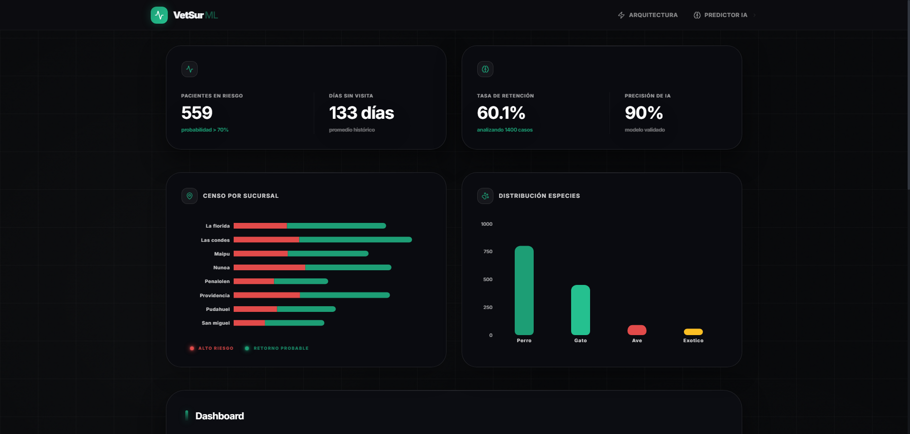

# Vetsur Analytics

Patient churn prediction and business intelligence platform for a network of 8 veterinary clinics. Combines an automated data cleaning and Random Forest classification API with a real-time monitoring dashboard and functional model diagnostics.

<br>

<p align="center">
  <a href="https://vetsur.daemonize.me" target="_blank" rel="noopener noreferrer">
    
  </a>
</p>

<br>

<p align="center">
  
</p>

## Architecture and Design

The platform uses a decoupled client-server architecture deployed on an Azure VPS with Docker Compose and Nginx reverse proxy.

```
[Next.js 14 Client] <--- HTTPS / JSON ---> [Nginx Proxy] <--- ASGI ---> [FastAPI Inference Service] <--- In-Memory ---> [Scikit-learn Model (.pkl)]
```

### Key Engineering Details

- **Feature Engineering & Selection**: Features are reduced to a top 7 ranking (dias_desde_ultima_visita, visitas_historicas, tipo_atencion_consulta_general, tiene_vacunas_al_dia, monto_cobrado, tipo_atencion_venta_producto, costo_medicamento), enforced via a JSON schema contract (columnas_vetsur.json).
- **Data Normalization & Imputation**: Text corruption and mojibake in categorical records are resolved using ftfy. Missing medication costs are imputed using median values grouped by service category (tipo_atencion) to avoid skew from surgical interventions.
- **Model Calibration & Diagnostic Telemetry**: Continuous operational evaluation includes ROC curve tracking (AUC 0.943), 2x2 confusion matrix analysis, and Gini feature importance inspection exposed through /api/evaluacion.
- **Inference Lifecycle**: Loads the serialized classifier during application startup as a singleton, categorizing churn probabilities into three distinct tiers: High (>= 0.65), Preventive Window (0.20 to 0.64), and Active (< 0.20).

## Tech Stack

- **Backend**: Python 3.11, FastAPI, Scikit-learn, Pandas, NumPy, Joblib, Pydantic v2, ftfy, Pytest
- **Frontend**: Next.js 14, React 18, TypeScript, Tailwind CSS, Framer Motion, Lucide React, TanStack Table v8
- **Infrastructure & QA**: Docker Compose, Nginx, GitHub Actions, Azure Linux VM, ESLint

## Project Structure

```
vetsur/
├── api/
│   ├── main.py
│   ├── modelo.py
│   ├── evaluacion.py
│   ├── esquemas.py
│   ├── modelo_vetsur.pkl
│   ├── columnas_vetsur.json
│   ├── tests/
│   └── Dockerfile
├── frontend/
│   ├── src/
│   │   ├── app/
│   │   ├── components/
│   │   └── types/
│   ├── Dockerfile
│   └── package.json
├── nginx/
│   └── nginx.conf
└── docker-compose.yml
```

## Local Setup

### Prerequisites

- Docker and Docker Compose (or Python 3.11+ and Node.js 20+)

### Running with Docker

```bash
git clone https://github.com/daemon1s/vetsur-ml-fastapi-nextjs.git
cd vetsur-ml-fastapi-nextjs

docker compose up -d --build
```

Access points:
- Dashboard: http://localhost:3000
- API Documentation: http://localhost:8008/docs

### Manual Development Setup

1. Start the API service:
```bash
cd api
pip install -r requirements.txt
uvicorn main:app --host 0.0.0.0 --port 8008 --reload
```

2. Start the Frontend application:
```bash
cd frontend
npm install
npm run dev
```
